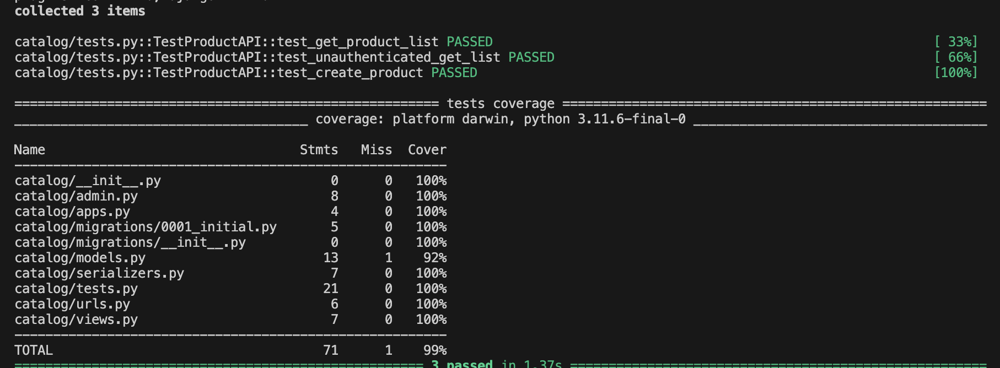

# Mini Project 2: E-commerce Backend (Minimal)

## Setup (uv)

```bash
uv venv
uv sync
```

## Run migrations

```bash
uv run python manage.py migrate
```

## Run server

```bash
uv run python manage.py runserver
```

## Docker (Redis + Django + Celery worker)

```bash
docker compose up --build
```

## Admin

```bash
uv run python manage.py createsuperuser
```

Admin URL: `http://127.0.0.1:8000/admin/`

## API quick test (curl)

### Get token

```bash
curl -s -X POST http://127.0.0.1:8000/api/auth/token/ \
  -H "Content-Type: application/json" \
  -d '{"username":"<user>","password":"<pass>"}'
```

### Create product

```bash
TOKEN="<paste_token_here>"

curl -s -X POST http://127.0.0.1:8000/api/products/ \
  -H "Authorization: Token $TOKEN" \
  -H "Content-Type: application/json" \
  -d '{"name":"T-Shirt","sku":"TSHIRT-001","price":"199000.00","stock_qty":50,"is_active":true}'
```

### Add item to cart

```bash
curl -s -X POST http://127.0.0.1:8000/api/cart/items/ \
  -H "Authorization: Token $TOKEN" \
  -H "Content-Type: application/json" \
  -d '{"product_id":1,"quantity":2}'
```

### Get cart (prefetch optimized)

```bash
curl -s http://127.0.0.1:8000/api/cart/ \
  -H "Authorization: Token $TOKEN"
```

### Checkout -> creates order (signals -> celery prints “email”)

```bash
curl -s -X POST http://127.0.0.1:8000/api/cart/items/checkout/ \
  -H "Authorization: Token $TOKEN"
```

### List orders (prefetch optimized)

```bash
curl -s http://127.0.0.1:8000/api/orders/ \
  -H "Authorization: Token $TOKEN"
```

## 🧪 Kiểm thử Code (Testing & Linting)
 Dự án đảm bảo chất lượng cao với các bộ test tự động:
### Kiểm tra độ bao phủ (Test Coverage)
uv run pytest -v --cov=.

### Kiểm tra code chuẩn PEP8 với Ruff
uv run ruff check .

### 📊 Test Coverage Result
Đây là kết quả kiểm thử của Day 7:

